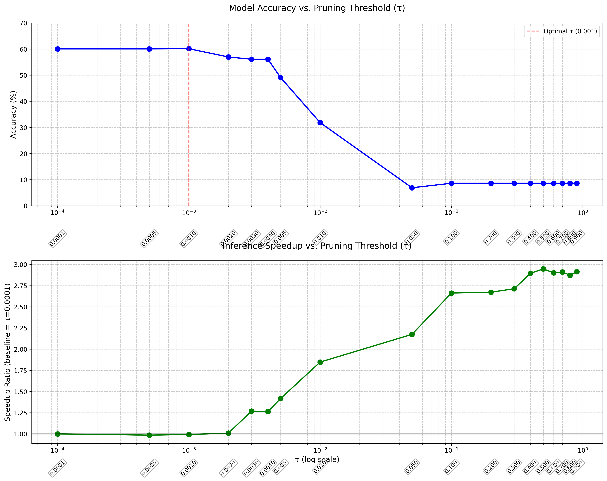

Of course. Based on your feedback, I've updated the README to more accurately describe the final training step. The key change is clarifying that the pruned architecture is **retrained from scratch** rather than fine-tuned.

Here is the revised README:

---

# ViT Pruning using Automated Circuit Discovery (ACDC)

This project provides a comprehensive pipeline for identifying and training a pruned Vision Transformer (ViT) model using the ACDC (Automated Circuit Discovery and Causal analysis) algorithm. The process involves training a baseline ViT, discovering a functional sub-circuit using activation patching, and then **retraining this pruned architecture from scratch** to recover performance.

The experiments are conducted on a custom "animal" subset of the Tiny ImageNet dataset.

## Key Features

-   A custom Vision Transformer (ViT) implementation in PyTorch with built-in pruning capabilities (`prune_heads`, `prune_mlp`, `retain_circuit`).
-   A modular `Trainer` class with support for mixed-precision, checkpointing/resuming, and advanced learning schedules.
-   An optimized implementation of the ACDC algorithm for discovering functional sub-circuits in neural networks.
-   Custom `ContrastiveWrapper` and `contrastive_collate_fn` for efficiently generating clean/corrupted data pairs needed for ACDC.
-   A comprehensive Jupyter notebook (`main.ipynb`) that orchestrates the entire workflow from data loading to training, pruning, and benchmarking.

## Repository Structure

```
.
├── notebooks/
│   └── main.ipynb          # Main entry point for all experiments.
├── src/
│   └── modules/
│       ├── acdc.py         # ACDC algorithm implementation.
│       ├── dataset.py      # Data loading, transforms, and contrastive wrapper.
│       ├── model.py        # ViT model definition with pruning methods.
│       ├── train.py        # Reusable Trainer class.
│       ├── utils.py        # Computational graph utilities and visualization.
│       └── paths.py        # Path management.
├── data/
│   └── ...                 # Caches for datasets and benchmark results.
├── checkpoints/
│   └── ...                 # Saved model weights and circuits.
├── logs/
│   └── ...                 # TensorBoard logs.
└── README.md
```

## Dataset

The project uses a custom-curated "animal" subset from the **Tiny ImageNet** dataset. The data loading logic in `src/modules/dataset.py` automatically filters for 58 animal-related classes.

The full list of class names for the original Tiny ImageNet-200 dataset is available as a string variable `tiny_imagenet_classes` within `src/modules/dataset.py`.

## Getting Started

### Prerequisites

-   Python 3.10+
-   PyTorch & Torchvision
-   `tqdm`, `graphviz`, `pygraphviz`, `datasets` (from Hugging Face), `matplotlib`
-   (Optional for visualization) `cmapy`

You can install the main dependencies with:
```bash
pip install torch torchvision tqdm datasets matplotlib
# For graph visualization (optional)
pip install graphviz pygraphviz cmapy
```

### How to Use

The primary way to run the experiments is through the **`notebooks/main.ipynb`** Jupyter notebook. This notebook contains the entire pipeline, controlled by several boolean flags at the top.

1.  **Clone the repository.**
2.  **Download Data:** The first time you run the notebook, it will automatically download the Tiny ImageNet dataset from Hugging Face and create the custom "animal" subset, caching them in the `data/` directory.
3.  **Configure the Experiment:** Open `notebooks/main.ipynb` and set the flags at the top of the notebook according to the desired action:

    -   `toy = True`: Use a tiny subset of the data for quick testing and debugging.
    -   `train_base = True`: Train the full baseline ViT model from scratch. The resulting checkpoint (`vit1.pth`) will be saved in `checkpoints/`.
    -   `run_acdc = True`: Run the ACDC algorithm on the trained baseline model to discover circuits for various pruning thresholds (τ). The circuits will be saved as a pickle file.
    -   `benchmark = True`: Test the accuracy and inference speedup for all discovered circuits without any fine-tuning.
    -   `train_pruned = True`: **Train a pruned model from scratch** based on the architecture defined by the optimal τ value.

## Methodology

The project follows a three-stage process:

1.  **Baseline Training:** A small ViT is trained on the 58-class animal dataset. The training uses modern techniques like MixUp, RandAugment, AdamW, and a linear warmup with a cosine annealing learning rate schedule.

2.  **Circuit Discovery with ACDC:** We use the ACDC algorithm to identify the most critical components (attention heads and MLP layers) for the classification task.
    -   The `ContrastiveWrapper` in `dataset.py` prepares data by providing "clean" inputs (e.g., an image of a dog) and "corrupted" inputs (e.g., images from other coarse categories like birds, fish).
    -   The `acdc.py` script iteratively patches activations from the clean input with those from the corrupted inputs at every edge in the model's computational graph.
    -   If an edge's contribution is non-causal (i.e., patching it does not significantly change the model's output distribution, measured by KL divergence), it is pruned. The sensitivity is controlled by a threshold, **τ**.

3.  **Pruning and Retraining from Scratch:**
    -   The circuit discovered from the baseline model is used as an **architectural blueprint**.
    -   A **new, smaller ViT instance is created with fresh, random weights**. The `retain_circuit()` method is immediately applied to remove all heads and MLP layers not included in the blueprint.
    -   This new, pruned model is then **trained from scratch** using the same training procedure as the baseline. This step demonstrates that the discovered sub-network is a strong inductive bias for learning the task efficiently.

## Results

The ACDC algorithm effectively identifies a smaller sub-network that, when trained, maintains high performance with a significant inference speedup.

-   **Accuracy vs. τ:** The benchmark plot shows a clear trade-off. For very small τ, almost no components are pruned, and accuracy is high. As τ increases, more components are pruned, leading to a drop in accuracy.
-   **Speedup vs. τ:** Conversely, as τ increases, the model becomes smaller, resulting in a significant inference speedup.



-   **Optimal Circuit:** Based on the benchmarks, a circuit with **τ=0.01** was chosen. This circuit prunes 41 out of 48 attention heads while preserving all MLP layers.
-   **Retraining:** After **retraining the pruned architecture from scratch**, the model achieves a final accuracy of **55.24%** on the validation set, demonstrating successful performance in a much smaller and faster model.
